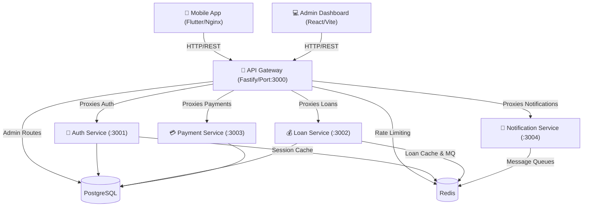

# System Architecture

The OYA system is built on a highly scalable microservices architecture contained within a Turborepo monorepo. It leverages modern web, mobile, and backend technologies separated into distinct layers to guarantee decoupling, scalability, and ease of maintenance.

## High-Level Diagram

## Core Layers

### 1. The Client Layer
- **Mobile Application:** A Flutter-based mobile application optimized for Android and Web. It uses `flutter_riverpod` for state management. It is served to the web via an Nginx container.
- **Admin Dashboard:** A React-based Single Page Application (SPA) providing staff a consolidated view of platform analytics, user KYC statuses, and loan applications.

### 2. The Gateway Layer
- **API Gateway:** All client traffic flows through this single entry point. It handles:
  - **Security:** Helmet headers and CORS policy.
  - **Rate Limiting:** Redis-backed rate limiter preventing DDOS and brute force attacks.
  - **Authentication:** Validates JWT access tokens centrally before forwarding requests to downstream services.
  - **Reverse Proxying:** Maps public routes (e.g., `/api/v1/loans/*`) to internal microservice URIs (`http://loan-service:3002/*`).

### 3. The Microservices Layer
We use **Fastify** as the core backend framework due to its incredible throughput performance.
- **Auth Service:** Issues JWTs, manages passwords, handles OTP logic, and tracks user devices/sessions.
- **Loan Service:** Manages the entire lifecycle of a loan from `DRAFT` and `SUBMITTED` states to `APPROVED` and `ACTIVE`. It also handles interest calculations and repayment schedule mapping.
- **Payment Service:** Interfaces with third-party payment gateways (e.g., MPESA Daraja API) to execute disbursements and receive customer repayments securely via webhooks.
- **Notification Service:** A worker-heavy service that listens to BullMQ message queues to dispatch emails, SMS messages, and push notifications asynchronously.

### 4. The Data & State Layer
- **PostgreSQL:** The single source of truth for persistent data. Managed entirely via **Prisma ORM** inside `packages/database`.
- **Redis:** Used extensively for ephemeral state, including:
  - Global API rate limiting
  - User session tokens cache
  - BullMQ background job queues (email dispatch, heavy data parsing)

### 5. The Observability Stack (LGTM)
- **Loki & Promtail:** Consolidates logs from all Docker containers into a searchable centralized log stream.
- **Prometheus:** Scrapes numeric metrics from the microservices.
- **Grafana:** Visualizes metrics and logs, offering a unified dashboard for system health monitoring.
